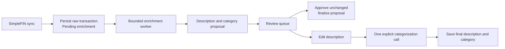

# Low-effort transaction review and trustworthy sync health — design

**Date:** 2026-07-30  
**Status:** Draft; revised for OpenAI provider migration

## Problem

Plutus is not yet making expense logging feel effortless:

- The current model integration already generates a plain-English note and tentative category, but Review asks the user to actively manage both fields.
- Editing the note can invoke the model during text entry, adding delay and unnecessary API calls.
- Tentative categories are included in spending reports before the user has confirmed what a transaction was.
- A SimpleFIN response containing upstream warnings can be recorded as a successful sync, even when the returned data is incomplete or stale.
- The dashboard makes its primary job—reviewing new expenses—visually equal to secondary account and reporting information.

## Product outcome

For a normal new expense, the user should do only this:

> Read the agent's plain-English description, then press **Approve** or make a small edit and press **Save & categorize**.

Plutus then records a final description and final category. The raw bank text remains available as evidence, while confirmed transactions—not agent guesses—drive spending insights.

## Scope

This release includes:

1. Agent-assisted description review and automatic categorization.
2. Sync outcome and data-health reporting that distinguishes healthy, degraded, failed, and skipped runs.
3. A dashboard structured around the next useful action: review transactions and resolve data-health issues.

It deliberately excludes budgets, recurring rules, bulk approval, income/cash-flow analysis, auto-approval, and a pending-transaction ledger. Those become useful only after the daily approval loop is trusted.

## Product decisions

### Preserve raw data; separate suggestions from final values

`Transaction.Description` remains the immutable SimpleFIN description. It continues to be the source for transfer detection and content deduplication. The feature must not overwrite it.

Add distinct fields for the agent proposal and the user-confirmed result:

| Field | Meaning |
| --- | --- |
| `SuggestedDescription` | Factual, short agent proposal shown in Review. |
| `SuggestedCategoryId` | Tentative category; never used by reports. |
| `SuggestionConfidence` / `SuggestedAt` | Observability only; not an auto-approval rule in this release. |
| `FinalDescription` | The approved or edited display description. |
| `ReviewedAt` | When the user confirmed the transaction. |
| `EnrichmentStatus` | `Pending`, `Processing`, `Ready`, `Failed`, `Finalized`, or `SkippedTransfer`. |
| `EnrichmentAttempts` / `LastEnrichmentError` | Bounded retry state and a safe, generic reason. |

`CategoryId`, `IsCategorized`, and `IsReviewed` remain the final, confirmed state for compatibility. `Note` remains an optional note; it is not repurposed as the user-facing description.

Migration rules:

- The migration must use the following conservative, testable mapping. It never treats an ambiguous unreviewed edit as final, and preserves every raw description and note.

| Legacy row | New proposal/final state |
| --- | --- |
| Reviewed, non-transfer | `FinalDescription = Description`, keep its final category, set `ReviewedAt` to the migration time only when no historical time is available. |
| Reviewed transfer | Preserve final transfer category and review state; mark `SkippedTransfer`. |
| Unreviewed with category and non-empty note | Copy note/category to proposal fields, clear final category fields, and mark `Ready`. This is the known shape of the existing AI-suggestion flow, but remains reviewable. |
| Unreviewed with category and no note | Copy raw description/category to proposal fields, clear final category fields, and mark `Ready`. |
| Unreviewed without category (with or without note) | Preserve note unchanged, create no proposal, and mark `Pending`; the worker proposes from raw description. |
| Any unreviewed row manually edited through the old history panel | It is intentionally handled by the applicable unreviewed row above. The old schema has no reliable provenance bit, so the migration must not guess that it was final. |

The migration is tested by upgrading a fixture SQLite database built from the pre-feature schema—not merely by creating the newest model from scratch.

### Enrich separately from bank synchronization

SimpleFIN ingestion must write newly received transactions immediately. A durable, bounded enrichment worker then asks the model for a proposal. Model latency, a rate limit, or a malformed result must never make a bank sync look failed.



Transfers bypass enrichment and review, as they do today.

The canonical state transitions are:

```text
Pending ──claim──> Processing ──valid proposal──> Ready ──approve──> Finalized
  ▲                    │                              │
  │                    └──failure──> Failed ──retry───┘
  └────────expired lease───────────────────────────────┘

SkippedTransfer is terminal. An edited-description categorization atomically claims `Ready` as `Processing`; it then moves to `Finalized` on success or `Failed` while preserving the user's edited final description on failure. A manual category selection finalizes directly. `Finalized` rows have `IsReviewed = true`, are never claimed again, and keep their final description/category.
```

The worker claims a row with an atomic compare-and-set transition from `Pending`/retryable `Failed` to `Processing`, recording a lease identifier, lease expiry, and next eligible retry time. It may only save a proposal when that lease is still held and the transaction is not finalized. On startup, expired leases return to `Pending`; review finalization always wins. Separate database contexts must be used in race-condition tests.

### OpenAI provider migration

OpenAI replaces Anthropic as Plutus's only model provider. The migration is a prerequisite to all remaining implementation milestones and has these fixed boundaries:

- Replace the `Anthropic` package/client/categorizer implementation with the official `OpenAI` .NET SDK. Use the Responses API with `store: false`, so the application does not request server-side response persistence for financial transaction descriptions. Preserve the `ICategorizer` contract so callers do not change behavior during the provider-only migration.
- Replace `ANTHROPIC_API_KEY` everywhere with `OPENAI_API_KEY`, read only from the process environment or the existing gitignored local secret mechanism. Never copy either key into configuration, SQLite, compose files, logs, tests, or documentation examples.
- Replace `Plutus:Claude:Model` with `Plutus:OpenAI:Model`. Default to `gpt-5.6-luna`, the cost-sensitive GPT-5.6 variant, while retaining configuration override for a different compatible OpenAI model.
- Use a strict JSON-schema structured-output request whose category remains constrained to the current user-managed category names. Set the configured model, low reasoning effort, a bounded 256-token output limit, and `store: false` on every request. Keep the existing factual-description guardrails and output fields (`category`, `note`, `confidence`); accept confidence only in the inclusive `0–1` range.
- Remove Anthropic-specific configuration, comments, package references, and user-facing wording from active surfaces: `src/`, `tests/`, project files, `appsettings*`, both Compose files, README, and CLAUDE.md. Historical design/plan documents remain an accurate record of their original provider and are not mechanically rewritten. There is no provider fallback: a deployment is either configured for OpenAI or reports a clear missing-key/configuration error.
- Test with fakes/mocked transport only. The migration must never spend API credits or require a real key in CI or containerized tests.

The later enrichment milestone changes the missing-key behavior: Plutus and SimpleFIN synchronization will then remain usable with an unavailable/no-op OpenAI enricher, allowing manual review. That resilience change is deliberately separate from this behavior-preserving provider swap.

### OpenAI deployment cutover

The provider migration is not deployed until its operational cutover is prepared:

1. Keep a known-good **authenticated** deployed image and its secure environment configuration as the rollback point; do not print, commit, or copy either provider key into task output. The pre-authentication image is never a public rollback target: keep it offline or behind temporary reverse-proxy access control until an authenticated replacement is running.
2. Add `OPENAI_API_KEY` to the deployed host's gitignored secret environment file. Verify Compose receives a non-empty key by running an in-container presence check that returns only an exit status—not `docker compose config`, which could print resolved secrets.
3. Build/recreate the container, then run a one-time sanitised categorization smoke check using only an invented merchant string. Verify it produces schema-valid category/note/confidence output and that the app reports no secret in logs.
4. If startup or the smoke check fails, roll back only to the known-good authenticated image and secure environment configuration; otherwise remove the obsolete Anthropic key from the deployed secret store. Follow the current [production authentication cutover checklist](../../../README.md#production-authentication-cutover-checklist).

This operational test is distinct from unit tests and is the only migration verification permitted to make a real model request.

### Use a narrowly scoped structured-output agent

Introduce an `ITransactionEnricher` boundary that receives only the raw description, amount, date, account name, and allowed category names. Its JSON result is:

```text
{ description, category, confidence }
```

The prompt must produce a concise factual description, reject instructions embedded in merchant text, never infer people/purpose/items not supported by the source text, and return a category constrained to the provided category list. Do not send balances, account history, or optional user notes to the model.

For an unchanged agent proposal, approval makes no second model request. For an edited description, exactly one categorization request occurs on explicit submission—never during typing. If it fails, the user's edit is saved, the card presents retry and manual-category paths, and the transaction is not silently marked complete.

The selected model remains configuration-driven. A lower-cost model should be the default for this bounded task, with the current configurable higher-capability option retained for override. Calls and failures may be counted, but descriptions and credentials must not be logged.

The application and bank synchronization must start when no model key is configured. In that state, a no-op/unavailable OpenAI enricher leaves transactions retryable and the Review page presents an editable manual path; it does not fail application startup. The same redaction policy applies to existing categorization and diagnostic code: remove raw merchant descriptions from failure logs, safely map upstream error text to bounded reason codes, and avoid account labels/last-four digits in model prompts and diagnostics unless strictly necessary and explicitly sanitized.

### Make the dashboard an action center

The dashboard answers, in order: **what needs my attention, can I trust the data, and what did I spend?**

```text
┌──────────────────────────── Action center ────────────────────────────┐
│  7 transactions ready to check                              ~2 min     │
│  The agent decoded each one.                      [Review transactions]│
└───────────────────────────────────────────────────────────────────────┘

┌────────── This month ──────────┐  ┌──── Spending breakdown ───────────┐
│  Reviewed spending              │  │  Category totals / drill-down      │
│  Top category                   │  │  [View transactions]               │
└────────────────────────────────┘  └───────────────────────────────────┘

Data health: Healthy / Attention / Failed / Not connected
Accounts and net worth: secondary detail
```

- The action center is the first significant surface when any review is pending; a quiet caught-up state replaces it otherwise.
- The Review page foregrounds the editable proposed description. Raw bank description, date, account, and amount are supporting evidence. The category appears as a supporting chip, with a manual override revealed only for exceptions.
- The transaction history displays `FinalDescription ?? Description` and exposes the raw description in its edit panel.
- Spending reports and dashboard totals include final categories only. Until a transaction is reviewed, it is excluded from confirmed spending.
- Navigation gives Review a pending-count badge and places it before Dashboard.

## Sync health decisions

"HTTP request completed" is not the same as "financial data is current." Record these distinct outcomes:

| Outcome | Meaning | Watermark behavior |
| --- | --- | --- |
| `Success` | Complete response with current account data. | Advance last-healthy watermark. |
| `Degraded` | Response completed but contained bridge warnings, missing expected accounts, or stale account data. | Do not advance last-healthy watermark. |
| `Failed` | Transport, authentication, parsing, or persistence failure. | Do not advance last-healthy watermark. |
| `Skipped` | No connection or a run was already active. | Do not advance last-healthy watermark. |

Persist the trigger (`manual`, `scheduled`, `startup`, `recovery`), duration, fetch window, account counts, and safe reason codes. Per-account observations record returned/not returned and freshness timestamps, never credentials or raw transaction text.

The classification policy is deterministic:

- Logical account matching happens before health classification, using the existing re-auth matcher so reminted SimpleFIN IDs do not appear missing.
- On the first successful connection there is no expected-account baseline; the returned logical account set establishes it.
- Thereafter, an account is expected only when it is explicitly active for sync. A user can retire/stop tracking an account in Settings; absence never auto-retires an account.
- A response is `Degraded` when it has bridge `errors[]`, omits an expected active logical account, or returns an active account whose bridge `balance-date` exceeds the configured `StaleAfterHours` threshold. A zero/invalid threshold is rejected at configuration binding.
- Returned accounts and their transactions are still ingested on a degraded response. Dedupe keeps the recovery replay safe, but the health state remains degraded.

`LastHealthyDataAt` is a health indicator, not an unbounded query cursor. Normal sync uses the completed fetch cursor plus the normal overlap. After a degraded/failed run, recovery re-fetches a bounded configurable trailing window (default 30 days) and shows the earliest possibly incomplete date. If that date falls outside the recovery window, Plutus requires an explicit, labelled backfill choice rather than silently expanding every daily request or pretending that the gap was repaired.

All manual, scheduled, startup, recovery, and reconnect operations pass through one in-process coordinator. A run already in progress is reported honestly rather than starting a competing SQLite write. Retry only transient failures with a bounded backoff. Authentication failures should request reconnect without repeated retries.

Reconnect first validates the new credential within the coordinator, preserves the known-good credential on validation failure, atomically swaps it only after validation, and runs a deduplicated recovery sync on success. A manual or scheduled sync that arrives during validation/replacement observes the coordinator state rather than either credential half-way through the swap. The dashboard and Settings must distinguish **credential saved** from **last verified healthy sync**.

Credential validity and data health are intentionally separate. Claim failure, malformed credentials, HTTP 401/403, an invalid/empty response, or an unparseable account payload is a validation failure: retain the current credential. An authenticated, parseable SimpleFIN response proves the replacement credential is valid even if it has bridge warnings, stale accounts, or missing expected accounts. In that case swap the credential atomically, record the validation/recovery state as `Degraded`, and begin the bounded recovery flow; do not discard a usable replacement merely because the upstream data is unhealthy.

Posted transactions remain the accounting default. The user-facing health view should state that explicitly so a recently authorized transaction is not mistaken for a failed sync.

## Access protection release gate

Plutus contains personal financial data and is hosted on a public HTTPS endpoint.
Application-level authentication/authorization with automated unauthorized-access coverage is
already implemented and remains a release prerequisite. The release does not proceed on the
assumption that TLS alone protects the app. Preserve the application boundary and record the
README runbook's unauthenticated-denial verification; no credentials belong in the repository.

## Key states

- **Agent proposal ready:** editable description, category chip, one-click approval.
- **Agent proposal failed:** raw source, editable blank/fallback description, retry and manual-category escape hatch.
- **Edited description:** a single explicit categorization call with clear busy state.
- **No connection:** a setup action rather than an empty dashboard mosaic.
- **Syncing:** one progress state and no competing sync action.
- **Degraded sync:** clear affected accounts/reason and Settings route.
- **Caught up:** confirmation plus reviewed spending snapshot.

## Acceptance criteria

1. Sync persists a new expense even if the enrichment agent is unavailable.
2. A ready transaction is normally completed with one approval action and no second agent request.
3. Editing a proposed description creates at most one categorization request on submission, persists the normalized edit, and never calls the model per keystroke.
4. A failed categorization never loses the user's description or marks the transaction reviewed; retry and manual category selection remain available.
5. Raw SimpleFIN descriptions are unchanged, and transfer detection/content deduplication continue to use them.
6. Unreviewed proposals do not affect confirmed spending totals; finalized transactions do.
7. A SimpleFIN response with warnings or stale/missing accounts is visibly degraded and leaves the last-healthy watermark unchanged.
8. Concurrent manual/scheduled sync attempts perform one ingestion sequence.
9. A failed reconnect preserves a previously working credential; a successful reconnect validates and immediately performs recovery sync.
10. Dashboard, disconnected, empty, agent-failure, degraded-sync, and in-progress states each provide a clear next action.
11. The app starts and bank sync operates without a model API key; transactions remain manually reviewable and retryable.
12. A worker with an expired or superseded lease cannot overwrite a reviewed transaction.
13. The production release has verified authenticated access; an unauthenticated request is denied before financial data is served.
